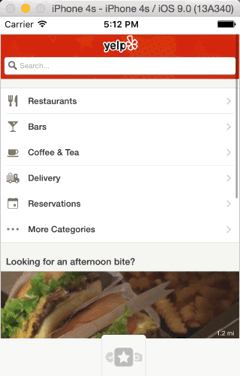

Version 1.3 of NativeScript introduced the much anticipated animations API and taking it out for a spin was exciting. Just as everything else NativeScript tries to do, animation has to expose a single common JavaScript API and work on all supported platforms including iOS and Android.

Two methods are provided for animating views out of the box (the “2” in the title), and a third method is an additional plugin that provides the missing Spring type of animation in iOS (the “plus 1” in the title). This post describes how these methods were used to simulate the menu animation found in the Yelp app.



#### Versions used in this post 

* NativeScript: 1.3.0

#### Related Resources 

* [NativeScript Animated Spring NPM Module (Plugin)](https://www.nativescript.org/blog/details/using-nativescript-animations-api)
* [GitHub repository with the Yelp simulation project](https://github.com/alexziskind1/nativescript-sample-yelp-animated-menu)

If you are unfamiliar with NativeScript or the new animations API, you can quickly get up to speed by looking at the [NativeScript docs section on animation](http://docs.nativescript.org/animation). Also, be sure to check out these great animation related posts for some samples: 

* [Using NativeScript animation APIs](https://www.nativescript.org/blog/details/using-nativescript-animations-api) by Valio Stoychev 
* [Using NativeScript Animations](https://www.nativescript.org/blog/details/using-nativescript-animations) by TJ VanToll 

## Installing and Running the Sample

This is quite easy to do. Make sure you have Node, Git, and NativeScript installed, of course, to continue. These are steps performed on a Mac.

1. Clone the GIT Repo with the sample project 

```
git clone https://github.com/alexziskind1/nativescript-sample-yelp-animated-menu.git
```

2. Change to the new project directory 

```
cd nativescript-sample-yelp-animated-menu
```

3. Install any missing NPM modules 

```
npm install
```

4. Add the iOS platform to the project 

```
tns platform add ios
```

5. Run the app in an iOS simulator (you can optionally run it on a real device too) 

```
tns emulate ios
```

## App Structure

The sample app structure is pretty simple. There is a [ScrollView](https://docs.nativescript.org/ApiReference/ui/scroll-view/HOW-TO.html) that allows you to scroll the background image and the blurred overlay image. The other key players are two images; an "open menu" image and a "close menu" image. Each of these images has a handler attached that listens for a tap gesture (provided by the [gesture module](https://docs.nativescript.org/gestures)). The animations are triggered on the tap gesture. 

## Method 1: Low Level Animation Class

At the lowest abstraction level of animation, NativeScript provides you with the `Animation` class. This class knows how to talk to the relevant iOS and Android animation APIs and something you, as the app developer doesn't need to worry about. You simply create some animation definitions, put them into an array and call the `play()` function on the new `Animation` object.

In the sample app, the photo button, check in button, and the blurred overlay image are bundled into an array of animation definitions that are passed into the `Animation` class constructor and played simultaneously (there is also an option to chain these animations and they will play one after the other, but I wanted them to all happen at the same time).

_**The effect**_


_**The code**_

```
var definitions = new Array();

var avCheckIn = {
    target: vCheckIn,
    translate: {
        x: -60,
        y: -80
    },
    duration: 200
};
definitions.push(avCheckIn);
 
var avPhoto = {
    target: vPhoto,
    translate: {
        x: 80,
        y: -80
    },
    duration: 200
};
definitions.push(avPhoto);
 
var aImgBlur = {
    target: imgBlur,
    opacity: 1,
    duration: 200
};
definitions.push(aImgBlur);
 
var animationSet = new animationModule.Animation(definitions);
animationSet.play().finished.then(function () {
        console.log("Animation finished");
    })
    .catch(function (e) {
        console.log(e.message);
    });
```

## Method 2: View.animate Convenience Function

[TJ's article](https://www.nativescript.org/blog/details/using-nativescript-animations) explains this method pretty well, so I won't go into too much detail here, other than to mention that the `animate` function is a convenience function that calls the low level `Animate` class under the hood (method 1).

In the sample app, the "open menu" and "close menu" images are animated using this function. The function returns a promise so it's very easy to chain consecutive animations using the `then` function.

_**The effect**_


_**The code**_

```
vBtnOpen.animate({
        translate: {
            x: 0,
            y: -45
        },
        duration: 100,
        opacity: 0
    })
    .then(function () {
        return vBtnClose.animate({
            translate: {
                x: 0,
                y: 0
            },
            duration: 150
        });
    });
```

## Method 3: View.animate Wrapper Provided by the nativescript-animation-spring Plugin

The default animation curves supported by iOS are somewhat lacking, unlike the plethora of curves available for Android. Apple only relatively recently introduced separate APIs that allow for the Spring effect (sometimes referred to as Bounce although I think they are very different). As of NativeScript version 1.3, this type of effect is not supported out of the box.

> NativeScript Plugin to the Rescue!

It is pretty easy to use native APIs in NativeScript, so creating a plugin to wrap that API call was trivial. That's exactly what the `nativescript-animation-spring` plugin does. The plugin can be separately installed into your project using this command:

```
tns plugin add nativescript-animation-spring
```

Then you simply require the module in your JavaScript code to make the `animate` function available.

```
var animationSpringModule = require("nativescript-animation-spring");
```

> **Note:** The key thing to remember here is that calling the `View.animate` function with the `curve` parameter equal to "spring" will route the animation parameters to use the iOS method that animates with the Spring effect instead of the standard easing curves.

In the sample app, the review button animates using the "spring" animation curve for a subtly different effect than its neighboring images.

_**The effect**_


_**The code**_

```
vReview.animate({
    translate: {
        x: 0,
        y: -100
    },
    scale: {
        x: 1,
        y: 1
    },
    duration: 500,
    delay: 0,
    dampingRatio: 0.6,
    velocity: 0.4,
    options: null,
    curve: "spring"
})
.then(function(){
    console.log('animation done');
});
```
